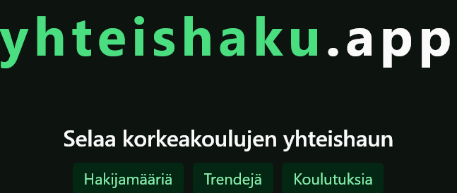

### Tietoa

Yhteishaku.app on sivusto korkeakoulujen yhteishakujen tarkasteluun. Sivustolta löydät:

- Hakijamäärät
- Pisterajat
- Koulutukset
- Trendit
- Todistusvalintapistelaskurin

### Kehitystyökalut

- TypeScript
- React.js
- Vike (staattisen sivun luomiseen, prerendering)
- _npm_ sijasta on käytössä _pnpm_
- Playwright e2e smoke-testaukseen
- Go (tilasto-, koulutus- ja pisterajadatan muokkaamiseen frontille sopivaan muotoon)

### Repon struktuuri

- /backend = Datan ja tyyppien generointi- ja siistimis CLI, joka ajetaan paikallisesti Go:lla.
- /frontend = Sivuston käyttöliittymä, sivut, komponentit, hookit yms.

### Tietojen päivittäminen

Hakijamäärien ja koulutusten päivitys tapahtuu manuaalisesti ajamalla /backend/-kansiossa tarvittavat komennot.  
Backend hakee Opintopolun ja Vipusen rajapinnoista uusimmat tiedot, siistii ne ja siirtää ne JSON-muotoisina /frontend/public/data/-kansioon.  
Generointi päivittää tiedostot `schools.json`, `statistics-<vuosi>.json` ja `meta.json` sekä frontendin `src/generated/dataManifest.ts`-tiedoston.

Yhteishaun pisterajat ladataan manuaalisesti Vipusen julkisesta pisteraja raportista ja muokataan excelillä backendille sopivaan CSV-muotoon.  
Tämän jälkeen ajetaan tarvittava Go CLI komento, joka generoi `frontend/public/data/`-polkuun tiedostot yhteishakukierroksittain, esimerkiksi `pisterajat-2026-kevat.json`.

Tarkemmat tiedot voit katsoa: [/backend/README.md](./backend/README.md)

Frontendin ajo-ohjeet: [/frontend/README.md](./frontend/README.md)

### Testit

Backendin testit ajetaan komennolla `go test ./...`
Frontendin e2e testit ajetaan komennolla `pnpm run test:e2e`

### Tilastojen lähteet

- [Opintopolku.fi](https://opintopolku.fi)
- [Vipunen](https://vipunen.fi)
