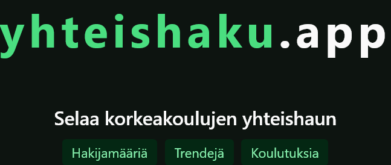

<div align="center">

</div>

[Site usage statistics](https://dashboard.simpleanalytics.com/yhteishaku.app)

I grew the site's audience without paid advertising. TikTok videos I made using the site as a source have received more than 300,000 views in total.

### About

Yhteishaku.app helps you explore Finnish higher education joint application data. The site includes:

- Applicant numbers
- Admission cutoffs
- Degree programmes
- Trends
- A certificate-based admission score calculator
- Browser agent tools on the calculator, programme list and applicant-number pages (WebMCP)

### Browser agent tools (WebMCP)

Three pages register [WebMCP](https://github.com/webmachinelearning/webmcp) tools while they are on screen. A browser agent can call the same filters and scoring as the UI, and the page updates to match. Chrome WebMCP is experimental. Enable `chrome://flags/#enable-webmcp-testing` to try it. There is no "agent tools ready" banner.

| Page | Tool | What the agent gets |
| --- | --- | --- |
| `/pistelaskuri/` | `calculate_todistuspisteet` | YO or AMM todistusvalinta score, then programmes the points reach. YO subjects use exam codes (`ai_fi`, `maa`, `fy`). Optional cutoff round is `2026-kevat`. |
| `/koulutukset/` | `search_koulutukset` | Every matching programme (`nimi`, `koulu`, `kunta`, `oid`), not one UI page of 10. Sector IDs are `yo` / `amk`; degree level is `alempi` / `ylempi`. |
| `/hakijamaarat/` | `search_hakijamaarat` | Every matching statistics row for a round such as `2026_kevat`. Counts under 5 show as `alle 5`; ratios stay empty when a source count is masked. Sector IDs are `Yliopistokoulutus` / `Ammattikorkeakoulukoulutus`. |

The tools run in the page. They do not add a third-party network request.

### Development tools

- TypeScript
- React
- Vike for prerendering the static site
- _pnpm_ as the package manager
- Playwright for end-to-end smoke tests
- Go for converting statistics, programme and admission cutoff data into frontend datasets

### Repository structure

- `/backend` contains the local Go CLI for generating and cleaning data and types.
- `/frontend` contains the website pages, components and hooks.

### Run locally

Install Node.js and pnpm 11, then run:

```sh
cd frontend
pnpm install
pnpm run dev
```

Open `http://localhost:3000`.

See the [frontend README](./frontend/README.md) for the full command list.

### Updating data

Run the required commands in `/backend` to update applicant numbers and degree programmes. The Go CLI fetches data from the Opintopolku and Vipunen APIs, cleans it and writes JSON files to `/frontend/public/data/`.

The generator updates `current_programs.json`, `schools.json` (institution catalog), joint-application applicant files under `frontend/public/data/hakijamäärät/` such as `hakijamaarat-2026-kevat.json` and `hakijamaarat-2025-syksy.json`, `meta.json` and `frontend/src/generated/dataManifest.ts`.

Download admission cutoffs from Vipunen's public cutoff report and use Excel to convert the read-only pivot table into the CSV format required by the backend. Run the cutoff CLI to generate one file per joint application in `/frontend/public/data/`, such as `pisterajat-2026-kevat.json`.

See the [backend README](./backend/README.md) for the data update commands and CSV format.

### Tests

Run backend tests from `/backend`:

```sh
go test ./...
```

Run frontend checks from `/frontend`:

```sh
pnpm run lint
pnpm run test:component
pnpm run test:e2e
```

### Data sources

- [Opintopolku.fi](https://opintopolku.fi)
- [Vipunen](https://vipunen.fi)

### Use of Codex and GPT-5.6

I used Codex and GPT-5.6 for:

- Project scaffolding
- Writing component and e2e tests
- Code review
- Best practice checks
- Interface design with the Figma MCP server
- Reformatting a read-only Excel pivot table into the CSV structure required by the data generator
- Learning about the technologies, patterns and domain concepts used in the project
