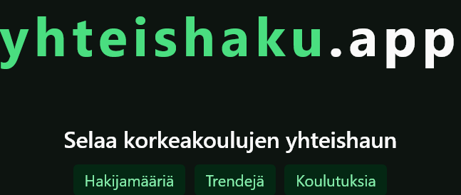

<div align="center">

</div>

### About

Yhteishaku.app helps you explore Finnish joint application data for higher education and upper secondary schools. The
site includes:

- Applicant numbers
- Admission cutoffs
- Upper secondary school admission averages
- Degree programmes
- Trends
- A certificate-based admission score calculator

### Development tools

- TypeScript
- React
- Vike for prerendering the static site
- _pnpm_ as the package manager
- Playwright for end-to-end smoke tests
- Go for converting statistics, programme and admission cutoff data into frontend datasets

### Repository structure

- `/backend` contains the local Go CLI for generating and cleaning data and types.
- `/frontend` contains the website pages, components and hooks.

### Run locally

Install Node.js and pnpm 11, then run:

```sh
cd frontend
pnpm install
pnpm run dev
```

Open `http://localhost:3000`.

See the [frontend README](./frontend/README.md) for the full command list.

### Tests

Run backend tests from `/backend`:

```sh
go test ./...
```

Run frontend checks from `/frontend`:

```sh
pnpm run lint
pnpm run test:component
pnpm run test:e2e
```

### Data sources

- [Opintopolku.fi](https://opintopolku.fi)
- [Vipunen](https://vipunen.fi)
