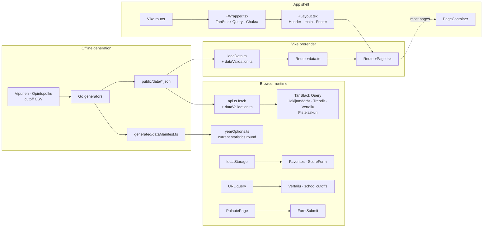

# Frontend

The frontend contains the website's pages, components and hooks. It uses React 19, TypeScript, Vike and Chakra UI. Vike prerenders the routes into a static site, which fetches the committed JSON files from `public/data/`.

### Requirements

- Node.js
- pnpm 11

### Quick start

```sh
pnpm install
pnpm run dev
```

Open `http://localhost:3000`.

### Commands

```sh
pnpm run dev        # Start the development server
pnpm run lint       # Run the score calculation tests, TypeScript and Biome
pnpm run build      # Generate the sitemap and build the static site
pnpm run preview    # Preview the production build
pnpm run test:unit  # Run the score calculation tests
pnpm run test:e2e   # Run the Playwright smoke tests
pnpm run format     # Format the src directory with Biome
```

The backend tools write the frontend datasets into `public/data/`. Tygo generates `src/types.gen.ts` and `src/types/pisterajat.gen.ts`, while the data generator updates `src/generated/dataManifest.ts`. Do not edit these files by hand.

See [`../backend/README.md`](../backend/README.md) for the data update commands.

### Architecture

#### App shell and data flow



#### Routes and main components

`:slug` and `:ala` are the URL forms of Vike's `@slug` and `@ala` route folders.

```mermaid
flowchart TB
  subgraph discovery["Browse and analyse"]
    home["/<br/>LandingPage"] --> homeParts["QuickLinkCard · useCountdown"]
    degrees["/koulutukset/<br/>SchoolsListPage"] --> degreeParts["SearchInput · FilterItem · useFilteredDegrees<br/>SchoolCard · Pagination"]
    stats["/hakijamaarat/<br/>StatsListPage"] --> statsParts["Search and filters · YearControl · useFilteredStatistics<br/>DegreeStatsCard · CompareBar · Pagination"]
    stats --> compare["/vertaile/<br/>ComparePage"] --> compareParts["ComparisonTable · ShareButton"]
    trends["/trendit/<br/>TrendsPage"] --> trendParts["YearControl · useTrendsData · TrendCard<br/>TopBarList · ApplicantTotalsChart"]
  end

  subgraph schools["Schools and cutoff scores"]
    schoolIndex["/koulut/<br/>SchoolIndexPage"] --> schoolIndexParts["SortControl · SchoolListCard"]
    schoolIndex --> school["/koulut/:slug/<br/>SchoolPage"] --> schoolParts["SchoolCard · DegreeStatsCard · Pagination"]
    school --> schoolCutoffs["/koulut/:slug/pisterajat/<br/>CutoffPage"]
    schoolCutoffs --> schoolCutoffParts["SearchInput · OptionSelect · SortControl<br/>useFilteredProgrammes · CutoffCard · Pagination"]
    cutoffIndex["/pisterajat/<br/>CutoffIndexPage"] --> fieldCutoffs["/pisterajat/:ala/<br/>AlaCutoffPage"]
    cutoffIndex --> schoolCutoffs
    fieldCutoffs --> fieldCutoffParts["CutoffCard · Pagination"]
    fieldCutoffs --> schoolCutoffs
  end

  subgraph calculator["Score calculator"]
    scorePage["/pistelaskuri/<br/>ScoreCalculatorPage"] --> scoreForm["ScoreForm"]
    scoreForm --> amm["AmmForm · ammScoring"]
    scoreForm --> yo["YoForm · yoForm · yoScoring"]
    scorePage --> scoreResults["Search and result filters<br/>ScoreResultList · ScoreResultCard"]
  end

  subgraph content["Content, saved items and support"]
    saved["/tallennetut/<br/>SavedListPage"] --> savedParts["useFavorites · SchoolCard"]
    guides["/oppaat/<br/>GuidesPage"] --> guide["/oppaat/yliopistojen-todistusvalinta/"]
    registry["guides.ts"] --> guides
    registry --> guideLayout["GuideLayout"]
    guide --> guideLayout --> mdx["content.mdx<br/>Callout · GuideAccordion · Chakra Table"]
    faq["/ukk/<br/>Accordion"]
    privacy["/tietosuojaseloste/"]
    feedbackPage["/palaute/<br/>PalautePage"]
    errorPage["_error<br/>ErrorPage"]
  end
```


